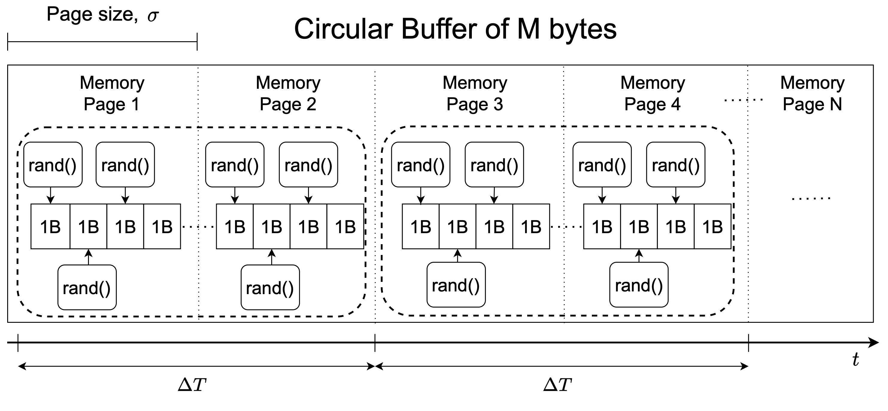

# Dirty Page Rate Generator (DPRGen)

This repository contains Dirty Page Rate Generator (DPRGen), our testing software that mimics an actual microservice with memory allocation and dirty page rate that can be finely controlled. Further details are available in our paper A. Calagna, Y. Yu, P. Giaccone and C. F. Chiasserini, "Design, Modeling, and Implementation of Robust Migration of Stateful Edge Microservices," in IEEE Transactions on Network and Service Management, vol. 21, no. 2, pp. 1877-1893, April 2024, [doi: 10.1109/TNSM.2023.3331750](https://ieeexplore.ieee.org/document/10314806/). Please cite the paper if you plan to use DPRGen in your publication.

DPRGen has been designed to run extensive yet controlled stateful migration experiments using CRIU and Podman. Specifically, we use DPRGen to estimate the parameters appearing in our Processing-aware Migration Model (PAM), an analytical model that, accounting for all the relevant real-world aspects of stateful migration, provides an accurate upper bound on downtime and total migration duration KPIs. 

DPRGen implements the microservice state as a circular buffer of size $M$ bytes whose content is continuously, yet properly, updated to achieve a given value of dirty page rate $R$. We recall that CRIU identifies the memory pages that have been changed in the MS state with respect to the previous predump/dump checkpoint image. Thus, to achieve a target value of dirty page rate $R$, DPRGen sequentially selects $N_R = R \cdot \Delta T$ pages over an arbitrary time interval $\Delta T$, and, in each of them, modifies some bytes by replacing them with random values.

We implemented DPRGen in C language, using malloc to allocate the circular buffer. Then, we considered a scratch container image and containerized DPRGen by encapsulating it along with its library dependencies. So doing, we obtain a synthetic MS whose behavior in terms of memory allocation and dirty page rate can be finely controlled.
